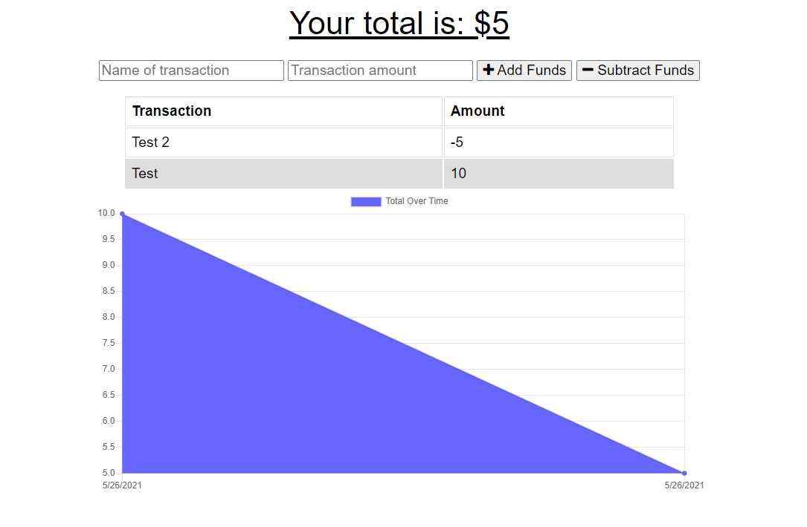

# Budget-Tracker
## Description
A Budget tracker that enables adding expenses and deposits with or without internet connection.

Deployed application can be viewed through the following link: [Budget-Tracker](https://pure-basin-96465.herokuapp.com/)

## Table of Contents

[Description](#Description)

[Technologies-&-tools-used](#Technologies-&-tools-used)

[Local-Installation](#Local-Installation)

[Usage](#usage)

[How-it-Works](#How-it-Works)

[License](#License)

[Badges](#Badges)

[Deployed-Application](#Deployed-Application)

[Tests](#tests)

[Questions](#questions)

## Technologies & tools used
1. HTML
2. JavaScript
3. MongoDB
4. Dependencies
    * compression
    * express
    * lite-server
    * mongoose
    * morgan

## Local Installation
To install the application locally, follow the following steps:
1. Clone the repo on your local machine
3. Install the followning dependencies:
    * [compression](https://www.npmjs.com/package/compression) through `npm i compression` command
    * [express](https://www.npmjs.com/package/express) through `npm i express` command
    * [lite-server](https://www.npmjs.com/package/lite-server) `npm i lite-server` command
    * [mongoose](https://www.npmjs.com/package/mongoose) thgouth `npm i mongoose` command
    * [morgan](https://www.npmjs.com/package/morgan) through `npm i morgan` command
4. Make sure that the MongoDB is running, through running the command `mongo` either on gitbash, command line or powershell
5. Run the local server using the command `npm start` or `node server.js`
6. To open the application locally, open localhost:3000 in your browser

## Usage
This application enables the user to be able to add expenses and deposits whether or not they have an internet connection.

## How It Works
Upon opening the application the user is presented with the Homepage which enables the user to add or subtract funds.

### Add Funds 
Adding Funds works online and added offline, once the user adds a Name of Transaction and Transaction Ammount and clicks on the + Add Funds button, the funds are added.

**Online**
    If the user is online the added funds will be directly added to the database and can be viewed on Robo 3T for testing pusposes.

**Offline**
     If the user is offline, the funds will be added to the UI and will be cashed using IndexDB however, the funds added will not show on Robo 3T until the user is back online and this cashed data is retrieved and pushed to the front-end database.

### Subtract Funds
Subtracting Funds works online and offline, once the user adds a NAme of Transaction and a Transaction Amount and clicks on the - Subtract Funds button, the funds are subtracted.
   
**Online**
    If the user is online the subtracted funds will be directly added to the database and can be viewed on Robo 3T for testing pusposes.

**Offline**
     If the user is offline, the subtracted funds will be added to the UI and will be cashed using IndexDB however, the funds added will not show on Robo 3T until the user is back online and this cashed data is retrieved and pushed to the front-end database.

## License

## Badges

## Deployed-Application
The Online/Offline Budget Tracker is deployed on Heroky through the following link: [Budget-Tracker](https://pure-basin-96465.herokuapp.com/) and the database is setup on MongoDB Atlas

## Tests
The Application is tested using the browser through operating it and inspecting to turn it online and offline and make sure that after the application was offline while adding or subtracting funds, the data is still available after going back online. The Database is tested using Robot 3T to make sure that once the user is online the front-end database is populated. 

## Questions
* My repositories can be found at https://www.github.com/aseppala98
* For any questions regarding this application, you can email me at SeppalaErin98@gmail.com